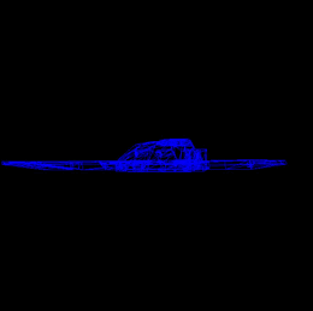

# SR 1: Carga de modelos

## Descripción del Código en C++ con SDL

Este código en C++ utiliza la biblioteca SDL (Simple DirectMedia Layer) para renderizar un modelo 3D cargado desde un archivo OBJ.

## Contenido

1. **Bibliotecas y Constantes:**
   - El código incluye varias bibliotecas como SDL, glm, iostream, vector, array, fstream, y sstream.
   - Se definen constantes como el ancho y alto de la ventana.

2. **Clase Color:**
   - Se define una clase `Color` para representar colores RGBA.

3. **Inicialización de SDL:**
   - Se inicia SDL y se crea una ventana y un renderer.

4. **Funciones de Dibujo:**
   - Funciones como `point`, `line`, y `triangle` utilizan las funciones de SDL para dibujar puntos, líneas y triángulos respectivamente.

5. **Función `render`:**
   - Utiliza las funciones de dibujo para renderizar un conjunto de vértices 3D en la ventana.

6. **Función `setupVertex`:**
   - Escala y transforma los vértices del modelo 3D según una escala predefinida.

7. **Función `loadOBJ`:**
   - Lee un archivo OBJ que contiene información sobre vértices y caras (triángulos) de un modelo 3D.
   - Calcula el centroide del modelo y aplica transformaciones de rotación alrededor de los ejes X, Y y Z.
   - Llena los vectores `out_vertices` y `out_faces` con la información del modelo.

8. **Función `main`:**
   - Inicia SDL, crea la ventana y el renderer.
   - Carga un modelo OBJ llamado "lab3.obj" utilizando la función `loadOBJ`.
   - Inicializa los vértices del modelo con `setupVertex`.
   - Entra en un bucle principal donde se rota continuamente el modelo y se vuelve a renderizar en la ventana hasta que se cierra la aplicación.

9. **Bucle Principal:**
   - Utiliza SDL para manejar eventos, como cerrar la ventana.
   - Rota los vértices del modelo en cada iteración del bucle principal y vuelve a renderizar la escena.

10. **Liberación de Recursos:**
    - Al salir del bucle principal, se liberan los recursos de SDL.

#MI MODELO:

